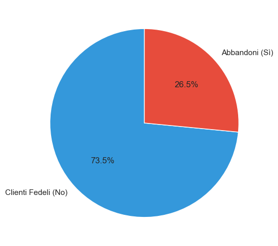
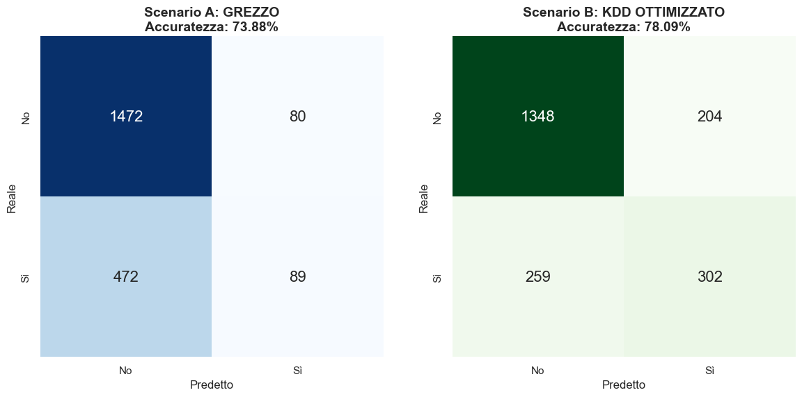
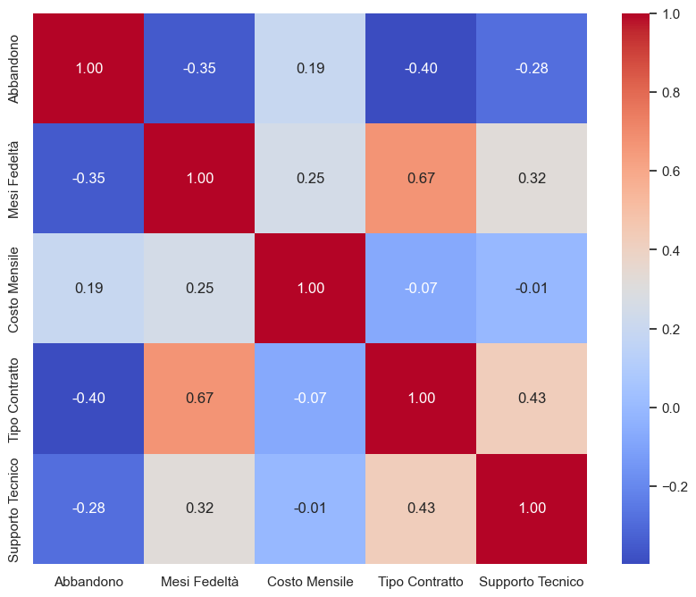

# 📊 Customer Churn Prediction — Telco (Metodologia KDD + KNN)

Confronto pratico tra un modello KNN allenato su dati grezzi e uno costruito seguendo il processo **KDD (Knowledge Discovery in Databases)**, applicato alla previsione dell'abbandono clienti (*churn*) in un'azienda di telecomunicazioni.


---

## 🎯 Obiettivo

KNN è un algoritmo basato sulla distanza tra punti: è estremamente sensibile a rumore, scala delle feature e dimensionalità. Per dimostrarlo, lo stesso identico algoritmo viene allenato due volte sullo stesso dataset:

- **Scenario A — Baseline**: dati grezzi, nessuna pulizia
- **Scenario B — KDD Ottimizzato**: pipeline completa di preprocessing secondo il processo KDD

Il confronto tra i due mostra l'impatto reale delle tecniche di data preparation, più che il merito dell'algoritmo in sé.

## 🧪 I due scenari

### Scenario A — Baseline (dati grezzi)
Il `customerID` (un identificativo praticamente unico per cliente) viene mantenuto e trasformato in numero: il modello lo tratta come se fosse un'informazione utile, introducendo la **Maledizione della Dimensionalità**. Nessuna normalizzazione: feature con scale molto diverse (es. `TotalCharges` in migliaia vs `tenure` in decine) pesano in modo sbilanciato sulla distanza euclidea. `k` fissato arbitrariamente.

### Scenario B — KDD Ottimizzato
Segue le fasi standard del processo KDD (Selection → Preprocessing → Transformation → Data Mining → Evaluation), descritte nel dettaglio sotto.

## 🔄 Metodologia KDD applicata

| Step | Tecnica | Dettaglio |
|---|---|---|
| **1. Data Cleaning** | Imputazione valori mancanti | Mediana di `TotalCharges`, calcolata **solo sul training set** |
| **2. Feature Selection** | Rimozione colonne non informative | `gender` (poco rilevante) e `customerID` (identificativo univoco → rumore puro) |
| **3. Data Transformation** | Binning dimostrativo | Discretizzazione di `tenure` in fasce (Nuovi / Fedeli / Storici), a scopo descrittivo |
| **4. Outlier Handling** | Metodo IQR | Bound calcolati sul training set; le righe outlier vengono escluse solo dal training, mai dal test |
| **5. Normalization** | Min-Max Scaling | Fit solo su training, poi applicato (`transform`) al test — cruciale per un algoritmo basato sulla distanza come KNN |
| **6. Model Selection** | Ricerca di `k` | 5-fold cross-validation sul training set, invece di un valore scelto a mano |

Tutte le statistiche (mediana, quantili, min/max) vengono apprese **esclusivamente dal training set** e poi applicate al test set, per evitare data leakage.

## 📁 Struttura del progetto

```
├── loader.py                 # Caricamento CSV e type-casting di TotalCharges
├── baseline_grezzo.py         # Scenario A: KNN su dati grezzi, non processati
├── kdd_ottimizzato.py          # Scenario B: KNN sulla pipeline KDD completa
├── main.py                     # Entry point: esegue entrambi gli scenari e li confronta
├── grafici.py                   # Genera le 5 visualizzazioni in immagini_output/
├── telco.csv                    # Dataset (IBM Telco Customer Churn)
├── requirements.txt
└── immagini_output/              # Grafici generati da grafici.py
```

## 📈 Risultati

| Scenario | Accuratezza | Recall classe "Sì" (abbandoni individuati) | k |
|---|---|---|---|
| Baseline (dati grezzi) | 73.9% | **15.9%** | 25 (fisso) |
| KDD Ottimizzato | 78.1% | **54.0%** | 50 (cross-validation) |

Il dataset è sbilanciato (~73% clienti fedeli, ~27% abbandoni): un modello che prevedesse sempre "nessun abbandono" otterrebbe già circa il 73% di accuratezza. Per questo il numero che conta davvero è il **recall sulla classe abbandono**: il Baseline intercetta solo 1 cliente a rischio su 6, la pipeline KDD ne intercetta più della metà — più che il triplo.

## 🖼️ Visualizzazioni

`grafici.py` genera 5 grafici in `immagini_output/`:



*Il churn riguarda circa un cliente su quattro: da qui la scelta di guardare al recall e non solo all'accuratezza.*



*Baseline vs KDD Ottimizzato: la pipeline ottimizzata individua molti più veri abbandoni (in basso a destra).*



*Il tipo di contratto e la fedeltà (mesi di permanenza) sono i fattori più correlati all'abbandono.*

Gli altri due grafici (`1_distribuzione_costi.png`, `4_ottimizzazione_contratti.png`) sono disponibili nella stessa cartella.

## ⚙️ Come eseguire il progetto

```bash
# 1. Clona il repository
git clone <url-del-tuo-repo>
cd <nome-repo>

# 2. (Consigliato) crea un virtual environment
python -m venv venv
source venv/bin/activate      # su Windows: venv\Scripts\activate

# 3. Installa le dipendenze
pip install -r requirements.txt

# 4. Esegui l'analisi completa (stampa a schermo il confronto dei due scenari)
python main.py

# 5. Genera i grafici
python grafici.py
```

## 📦 Dataset

[IBM Telco Customer Churn](https://www.kaggle.com/datasets/blastchar/telco-customer-churn) — 7.043 clienti, 21 variabili (dati demografici, servizi attivi, informazioni contrattuali ed economiche), target binario `Churn` (Yes/No).

## 🔍 Note metodologiche

- **Niente data leakage**: mediana, quantili IQR e parametri del Min-Max Scaler sono calcolati solo sul training set, mai su tutto il dataset prima dello split.
- **Gli outlier si rimuovono solo dal training**: il test set resta intatto, come i dati che il modello incontrerebbe davvero in produzione (non si possono "scartare" clienti reali).
- **`k` non è un numero a caso**: viene scelto tramite cross-validation sul training set.
- **L'accuratezza da sola non basta** su un dataset sbilanciato: il classification report (precision/recall/F1 per classe) accompagna ogni scenario.

## 👤 Autore

*[Il tuo nome]* — *[link LinkedIn / portfolio]*

## 📄 Licenza

Questo progetto è distribuito con licenza MIT (o la licenza che preferisci: GitHub te la propone automaticamente in fase di creazione del repository).
